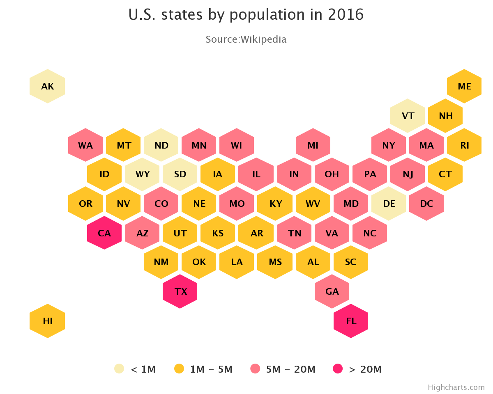

# Project_3
Project Proposal

Topic: The United States gas market over time.  
	With regards to Supply, Price, Trade
	
Rationale: COVID-19 / Oil Prices of late,  coupled with interest in seeing the market of an essential good over time.

Datasets: Provided in the repository.

Sketch of Final Design: A dashboard
